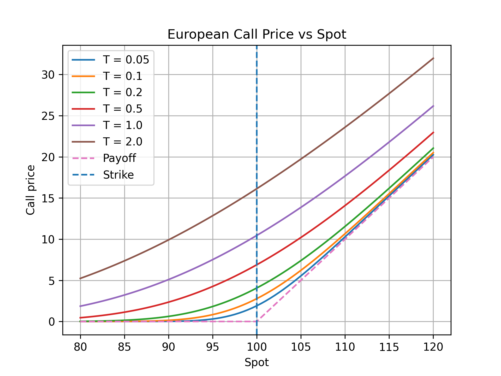
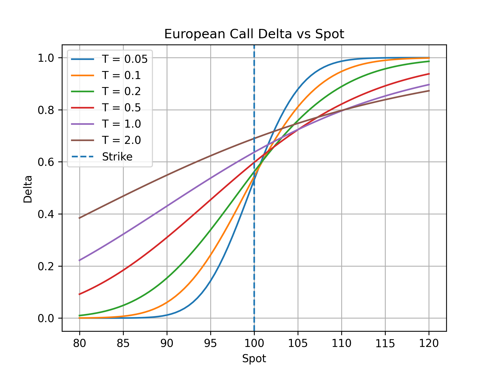
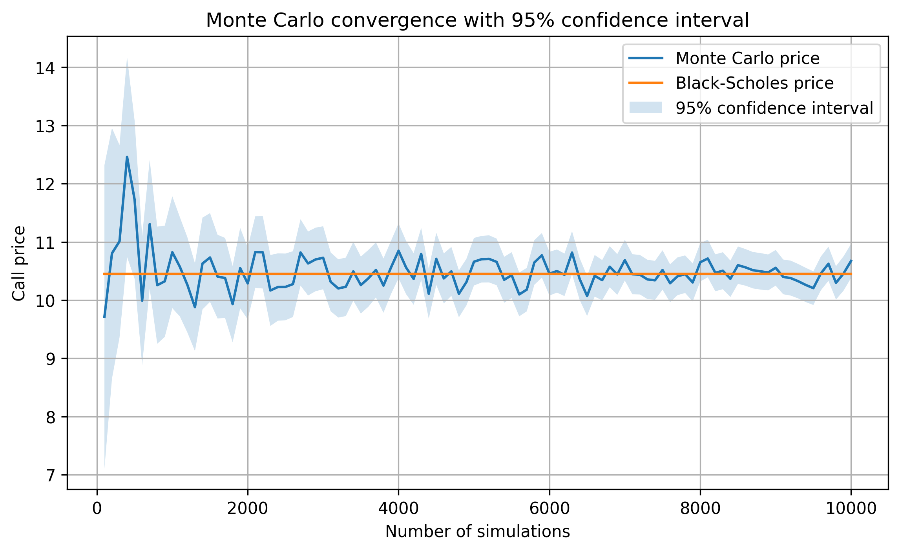
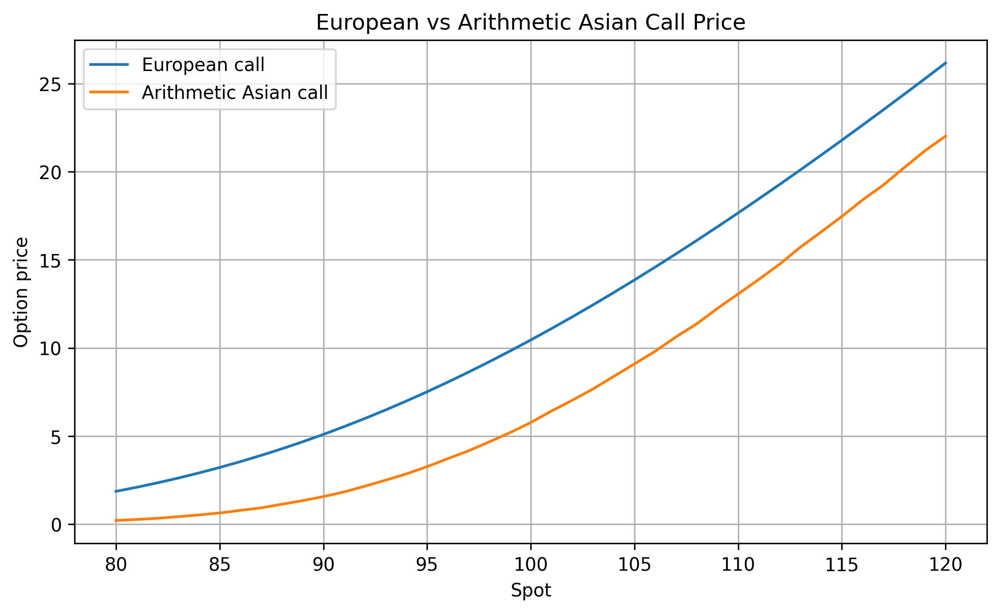
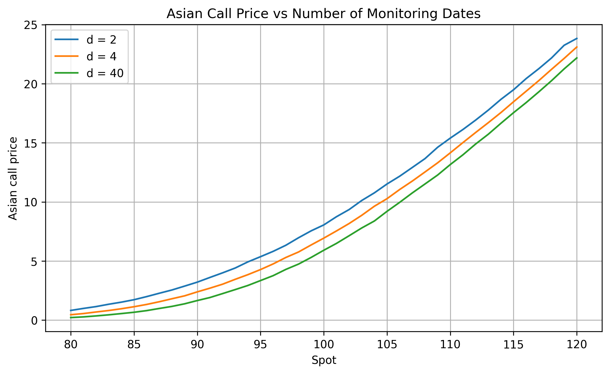

# Derivative Pricing Engine

C++ quantitative finance project implementing option pricing models and numerical experiments.

## Features

- European call/put payoff
- Black-Scholes closed-form pricing
- Greeks: Delta, Gamma, Vega
- Monte Carlo pricing with confidence intervals
- Convergence analysis
- Arithmetic Asian option pricing
- Geometric Asian option pricing
- CSV generation and Python plots

## Project Structure

```text
include/     Header files
src/         C++ implementation files
examples/    Numerical experiments
scripts/     Python plotting scripts
results/     Generated CSV files
plots/       Generated figures

```
## Methodology

The project implements several pricing methods for derivative products under the assumption of geometric Brownian motion.

- Comparison between analytical Black-Scholes price and Monte Carlo estimator
- Monte Carlo convergence with increasing number of simulations
- Confidence interval width analysis
- Distribution of Monte Carlo estimators
- European versus Arithmetic Asian option pricing
- Impact of monitoring dates on Asian option pricing


## Sample Results

### Black-Scholes Price Evolution




### Delta




### Monte Carlo Convergence



### European vs Asian Option Pricing



### Monitoring Frequency Effect on Asian Options



## Models Implemented

### Black-Scholes Analytical Pricing

Closed-form pricing formula for European options under the Black-Scholes framework.

### Monte Carlo Pricing

Simulation of asset trajectories under geometric Brownian motion with confidence interval estimation.

### Asian Options

Pricing of path-dependent arithmetic and geometric Asian options using Monte Carlo path simulation.

## Future Extensions

Possible future improvements:

- Barrier option pricing
- Variance reduction techniques
- Control variates
- Finite difference methods for PDE pricing
- Implied volatility solver
